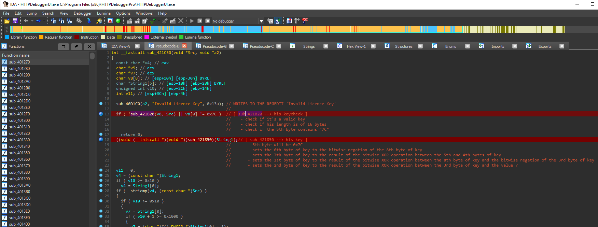
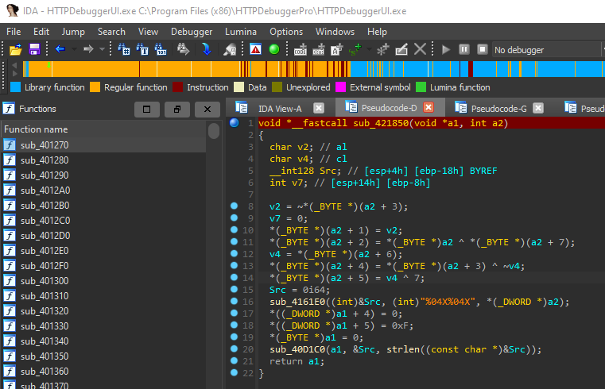
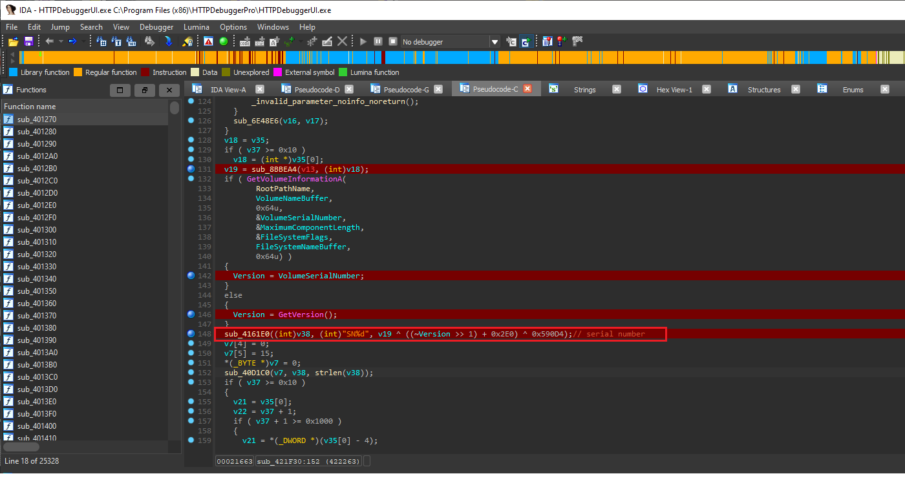

<h1 align="center">HTTPDebuggerPro Keygen</h1>

# Simple httpdebugger keygen
> This program will generate a license key, writing it to his registry path ( Software\\MadeForNet\\HTTPDebuggerPro ).
> Before using it, be sure that you opened HTTPDebugger at least one time, then start the program and it will automatically activate the license for you.

<h2 align="center">How HTTPDebugger's checks are structured</h2>

This is how his key is structured. Pretty much explained into the screen.

  

  

The serial number is based on httpdebugger's version and disk's serial number. Basically the SerialNumber is given by his version ( v19 ) that calculates the XOR of the value with the result given by shifting 'Version' one bit to the right, then the result is added to '0x2E0' and the final result value is XORed with '0x590D4'

  

